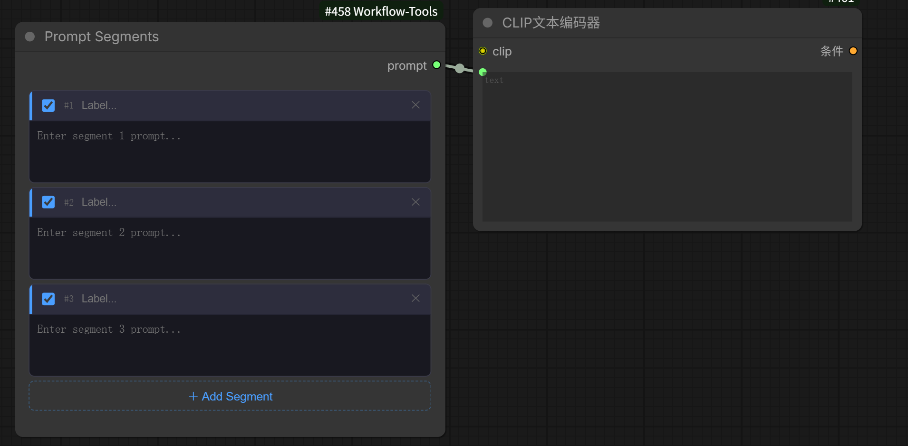

```markdown
# ComfyUI-Workflow-Tools

A collection of custom nodes for ComfyUI.

## Installation

Clone into your ComfyUI custom_nodes folder:

```bash
cd ComfyUI/custom_nodes
git clone https://github.com/Danchi93/ComfyUI-Workflow-Tools
```

Restart ComfyUI.

---

## Multi LoRA Loader

Manage multiple LoRAs in a single node.


### Features

- Enable/disable each LoRA with a toggle switch
- Adjust weight per LoRA
- Add notes to each LoRA
- Add/remove LoRAs dynamically

### Usage

Add the **Multi LoRA Loader** node in your workflow. Connect the model input, then use the output as you would a standard LoRA Loader.

### Language

The UI defaults to English. To switch to Chinese, open `multi_lora_loader.js` and change line 4:

```js
const LANG = "zh";  // "en" for English, "zh" for Chinese
```

---

## Prompt Segments

Combine multiple prompt segments into one node and output them in order — no manual concatenation needed.



### Features

- Add/remove prompt segments dynamically
- Enable/disable each segment individually
- Add a label to each segment for organization
- Outputs all enabled segments merged in order

### Usage

Add the **Prompt Segments** node in your workflow. Connect the prompt output to a CLIP Text Encoder or any node that accepts text input.

### Language

The UI defaults to English. To switch to Chinese, open `prompt_segments.js` and change line 4:

```js
const LANG = "zh";  // "en" for English, "zh" for Chinese
```

---

## 中文介绍

本仓库包含多个 ComfyUI 自定义节点。

### 安装方法

将仓库克隆到 ComfyUI 的 custom_nodes 目录：

```bash
cd ComfyUI/custom_nodes
git clone https://github.com/Danchi93/ComfyUI-Workflow-Tools
```

重启 ComfyUI 即可。

---

### Multi LoRA Loader

在单个节点中管理多个 LoRA。

#### 功能特性

- 每个 LoRA 可单独开关
- 可单独调整每个 LoRA 的权重
- 支持为每个 LoRA 添加备注
- 动态增删 LoRA 条目

#### 使用方法

在工作流中添加 **Multi LoRA Loader** 节点，连接模型输入，输出用法与标准 LoRA Loader 相同。

#### 语言切换

界面默认显示英文。如需切换中文，打开 `multi_lora_loader.js`，修改第 4 行：

```js
const LANG = "zh";  // "en" 为英文，"zh" 为中文
```

---

### Prompt Segments

将多段提示词合并到一个节点中，按顺序输出，无需手动拼接。

#### 功能特性

- 动态增删提示词段落
- 每段可单独开关
- 支持为每段添加标签便于管理
- 按顺序合并所有启用的段落后输出

#### 使用方法

在工作流中添加 **Prompt Segments** 节点，将 prompt 输出连接到 CLIP 文本编码器或任何接受文本输入的节点。

#### 语言切换

界面默认显示英文。如需切换中文，打开 `prompt_segments.js`，修改第 4 行：

```js
const LANG = "zh";  // "en" 为英文，"zh" 为中文
```
